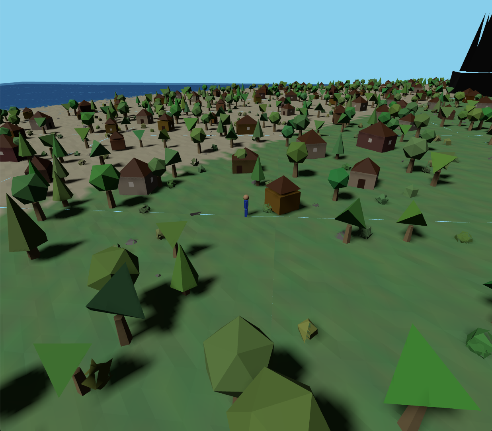

# Perspective Game

You can play the game at: [game1.bozmen.xyz](https://game1.bozmen.xyz)

This is what you'll see when you open the game:
[](https://game1.bozmen.xyz)

**Controls:**
- W-A-S-D keys to move your character
- Hold and drag left mouse button to look around
- Left click to interact with objects in the world

**Getting Started:**
If you spawn underwater (which can happen randomly):
1. Click and drag your mouse to look around for land
2. Use WASD keys to swim towards the nearest shore
3. Alternatively, you can refresh the page for a new spawn location on land


## Introduction

This game implements an infinite procedural world generator with low-poly assets, character controls, terrain systems, and collision detection. This document will help you understand the codebase organization, key components, and how to navigate the project.

##### Techstack:
- Three.js
- Vite
- JavaScript

##### Glossary:
- **Third person game (perspective game)**: A game where the player controls a character that is viewed from a third person perspective.
- **Procedural world generation**: The process of generating a world using algorithms rather than a pre-defined level design.
- **Low-poly art style**: A style of art that uses simple, blocky shapes to create objects.
- **Terrain**: The surface of the world.
- **Chunk**: A part of the world that is generated at once.


## Table of Contents

- [Getting Started](#getting-started)
- [Project Structure](#project-structure)
- [Core Components](#core-components)
- [Design Patterns](#design-patterns)
- [Tips and Tricks](#tips-and-tricks)
- [Common Tasks](#common-tasks)

## Getting Started

### Prerequisites

- Node.js (v14 or later)
- npm or yarn

### Installation

1. Clone the repository
2. Install dependencies:
```bash
npm install
# or
yarn
```

### Development

Start the development server:
```bash
npm run dev
# or
yarn dev
```

The development server will start at http://localhost:5173 (or another port if 5173 is in use)

### Building for Production

```bash
npm run build
# or
yarn build
```

## Project Structure

```
src/
├── index.js              # Main entry point
├── assets/               # Low-poly asset classes
│   ├── LowPolyTree.js
│   ├── LowPolyRock.js
│   ├── LowPolyBuilding.js
│   ├── LowPolyApartment.js
│   ├── LowPolyRoad.js
│   └── LowPolyMegaRock.js
├── entities/             # Game entities
│   └── PlayerController.js
├── systems/              # Game systems
│   ├── SystemManager.js
│   └── CollisionSystem.js
└── world/                # World generation
    ├── WorldGenerator.js
    ├── TerrainChunk.js
    └── ObjectPlacer.js
```

## Core Components

### Entry Point - `src/index.js`

The main entry point initializes the Three.js scene, camera, and renderer. It creates the world generator, system manager, and player controller. This is where the game loop is set up and where rendering happens.

```javascript
// Main game loop
function animate() {
  requestAnimationFrame(animate);
  
  // Update player
  player.update();
  
  // Update world based on player position
  worldGenerator.update(player.position);
  
  // Update systems
  systemManager.update(player);
  
  // Render
  renderer.render(scene, camera);
}
```

### World Generation - `src/world/WorldGenerator.js`

The `WorldGenerator` class is responsible for creating and managing terrain chunks based on the player's position. It uses a chunk-based system to create an infinite world, loading and unloading chunks as needed.

Key methods:
- `findSpawnPoint()`: Finds a suitable starting position on land
- `update(playerPosition)`: Updates visible chunks based on player position

### Object Placement - `src/world/ObjectPlacer.js`

The `ObjectPlacer` is responsible for populating the world with objects like trees, rocks, buildings, and roads. It works in tandem with the `WorldGenerator` to place objects in each terrain chunk.

Key methods:
- `placeObjectsInChunk(chunk)`: Populates a terrain chunk with objects
- `createRoadNetwork()`: Creates road connections between buildings

### Player Control - `src/entities/PlayerController.js`

The `PlayerController` class handles player movement, input detection, and camera controls. It creates a low-poly character model and manages player interaction with the world.

### System Manager - `src/systems/SystemManager.js`

The `SystemManager` serves as a central coordinator for all game systems like collision detection. It provides a unified update cycle for all systems.

### Collision System - `src/systems/CollisionSystem.js`

The `CollisionSystem` handles collision detection between the player and world objects. It prevents players from walking through objects and handles terrain collision.

## Design Patterns

### Factory Pattern

Asset classes act as factories for creating various game objects. For example, `LowPolyTree` creates different types of trees:

```javascript
// LowPolyTree.js
create(x, y, z) {
  // Randomly choose a tree type
  const treeType = Math.floor(Math.random() * this.leafGeometries.length);
  // ... create and return the tree
}
```

### Component-Based Architecture

The game separates functionality into distinct components with clear responsibilities:
- World generation
- Object placement
- Player control
- Collision detection

This makes the code easier to maintain and extend.

### Manager Pattern

The `SystemManager` coordinates multiple game systems and provides a unified interface for updating them:

```javascript
// SystemManager.js
update(player) {
  // Calculate delta time
  const deltaTime = (currentTime - this.previousTime) / 1000;
  
  // Update each system
  for (const systemName in this.systems) {
    const system = this.systems[systemName];
    if (system.enabled) {
      system.update(player, deltaTime);
    }
  }
}
```

### Chunk-Based Loading System

The world uses a chunk-based system for procedural generation and efficient memory management:

```javascript
// WorldGenerator.js
update(playerPosition) {
  // Get the chunk coordinates the player is in
  const currentChunkX = Math.floor(playerPosition.x / this.CHUNK_SIZE);
  const currentChunkZ = Math.floor(playerPosition.z / this.CHUNK_SIZE);
  
  // Generate or update chunks within render distance
  for (let x = -RENDER_DISTANCE; x <= RENDER_DISTANCE; x++) {
    for (let z = -RENDER_DISTANCE; z <= RENDER_DISTANCE; z++) {
      // ...
    }
  }
  
  // Remove chunks that are too far away
  // ...
}
```

## Tips and Tricks

### Working with the World Generator

When extending world generation:
1. Modify `TerrainChunk.js` to change terrain characteristics
2. Add new object types to `ObjectPlacer.js`
3. Adjust `RENDER_DISTANCE` in `WorldGenerator.js` to change visible world size (higher values impact performance)

### Adding New Asset Types

To add a new low-poly asset:
1. Create a new class in the `assets` folder (follow the pattern of existing assets)
2. Implement a `create(x, y, z)` method that returns a Three.js object
3. Add the new asset to `ObjectPlacer.js`

Example:
```javascript
// src/assets/LowPolyFence.js
import * as THREE from 'three';

export class LowPolyFence {
  constructor() {
    // Initialize geometries
  }
  
  create(x, y, z) {
    // Create and return fence object
  }
}

// Then in ObjectPlacer.js
this.fenceFactory = new LowPolyFence();
```

### Adding New Game Systems

To add a new game system:
1. Create a new class in the `systems` folder
2. Implement an `update(player, deltaTime)` method
3. Register the system in `SystemManager.js`

```javascript
// In SystemManager.js
initializeSystems() {
  // Existing systems
  this.systems.collision = new CollisionSystem(this.worldGenerator);
  
  // New system
  this.systems.myNewSystem = new MyNewSystem();
}
```

### Performance Optimization

- Use object pooling for frequently created/destroyed objects
- Adjust `RENDER_DISTANCE` based on target hardware
- Consider LOD (Level of Detail) for distant objects
- Use `THREE.InstancedMesh` for repeated objects like trees

## Common Tasks

### Adding a New Building Type

```javascript
// 1. Create a new building class
// src/assets/LowPolyShop.js
import * as THREE from 'three';

export class LowPolyShop {
  // Similar to LowPolyBuilding but with shop features
}

// 2. Add to ObjectPlacer.js
constructor(scene, seed) {
  // ...
  this.shopFactory = new LowPolyShop();
}

// 3. Add placement logic in placeObjectsInChunk method
```

### Implementing a Physics System

```javascript
// 1. Create a new physics system
// src/systems/PhysicsSystem.js
export class PhysicsSystem {
  constructor() {
    this.enabled = true;
    this.gravity = -9.8;
  }
  
  update(player, deltaTime) {
    // Apply gravity and other physics
  }
}

// 2. Register in SystemManager.js
initializeSystems() {
  // ...
  this.systems.physics = new PhysicsSystem();
}
```

### Customizing Terrain Generation

Modify `TerrainChunk.js` to change how terrain is generated:

```javascript
// Adjust these values to change terrain characteristics
generateHeight(x, z) {
  // Increase mountain height
  const mountainScale = 0.03;
  const mountainHeight = 15; // Increase for higher mountains
  
  // Adjust terrain roughness
  const roughnessScale = 0.1;
  const roughnessAmount = 0.8; // Increase for rougher terrain
  
  // ... rest of the method
}
```

## Conclusion

This 3D RPG framework provides a solid foundation for building immersive open-world games with Three.js. The component-based architecture makes it easy to extend and customize. When adding new features, follow the established patterns and organization to maintain code quality and performance.

Happy game development!
